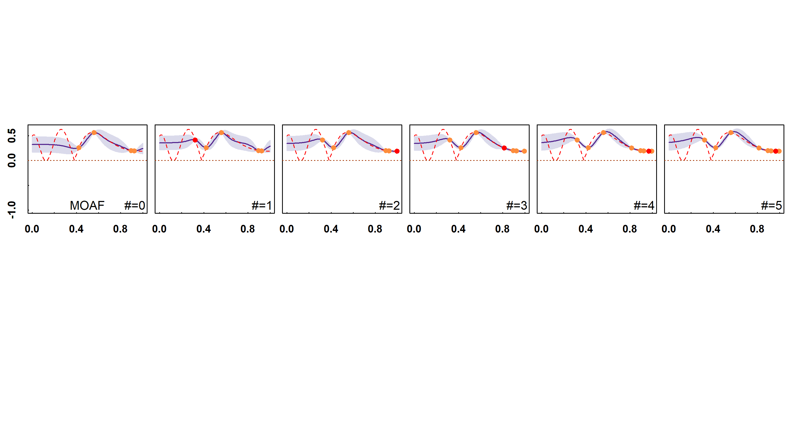

```r
knitr::opts_chunk$set(fig.width = 10, fig.height = 5.5,out.width="100%", dpi = 300)
#print(knitr::opts_chunk$get("fig.width"))  # 
#print(knitr::opts_chunk$get("fig.height"))  # 
setwd("C:\\Users\\12758\\Desktop\\target_oriented_BO\\1D\\specific\\MOAF")
library(RColorBrewer)

###########Read data
aa0=read.csv("yy0.csv")
aa1=read.csv("1.csv")
aa5=read.csv("2.csv")
aa15=read.csv("3.csv")
aa25=read.csv("4.csv")
aa50=read.csv("5.csv")
bb0=read.csv("ee0.csv")
bb1=read.csv("1ee.csv")
bb5=read.csv("2ee.csv")
bb15=read.csv("3ee.csv")
bb25=read.csv("4ee.csv")
bb50=read.csv("5ee.csv")
cc0=read.csv("0train.csv")
cc1=read.csv("1train.csv")
cc2=read.csv("2train.csv")
cc3=read.csv("3train.csv")
cc4=read.csv("4train.csv")
cc5=read.csv("5train.csv")
cc6=read.csv("6train.csv")
tar_data=read.csv("tar_data.csv", row.names = 1)
total.data.x=read.csv("total.data.x.csv", row.names = 1)
total.data.y=read.csv("total.data.y.csv", row.names = 1)

ym=0.03########ylim of utility plot
##############1D function


#display.brewer.all(type = "seq")
library(RColorBrewer)
#display.brewer.all(type = "seq")
#pdf("MOAF.pdf",width=11.7,height=6)
par(mfrow = c(2,6),mai=c(0.07,0.05,0.07,0.05),omi=c(1.5,0.3,1.5,0.1))
#plot 1-1
plot(aa0[,"x"], aa0[,"mean"], type="l",  ylab="y",xlab="x",col="black", lwd=1.5, tck=0.01,font=2,font.lab=2,ylim=c(-1,0.65),cex.axis=1.2,cex.lab=1.2)
polygon(c(aa0[,"x"],rev(aa0[,"x"])), c(aa0[,"lower"], rev(aa0[,"upper"])), col=brewer.pal(9, "Purples")[3], border = brewer.pal(9, "Purples")[3])
lines(aa0[,"x"], aa0[,"mean"], type="l",  xlab="x", ylab="|y-t|", col=brewer.pal(9, "Purples")[8], lwd=1.5)
text(x = 0.93, y = -0.9, labels = "#=0",cex = 1.4,font=1.7 )
text(x = 0.5, y = -0.9, labels = "MOAF",cex = 1.4,font=1.7 )
par(new=T)
plot(unlist(total.data.x),unlist(total.data.y), xaxt="n",type="l", lty=2, ylab="y",xlab="x",col="red", lwd=1, tck=0.01,font=2,font.lab=2,ylim=c(-1,0.65),cex.axis=1.2,cex.lab=1.2)
points(unlist(cc0[,"x"]),unlist(cc0[,"pro.es"]), pch=20,col=brewer.pal(9, "Oranges")[5],cex=1.7)
abline(h=unlist(tar_data),type="l", lty=3, ylab="y",xlab="x",col=brewer.pal(9, "Oranges")[8], lwd=1, tck=0.01,font=2,font.lab=2,ylim=c(-1,0.65),cex.axis=1.2,cex.lab=1.2)
```

```
## Warning in int_abline(a = a, b = b, h = h, v = v, untf = untf, ...):
## 图形参数"type"已过期不用了
```

```r
#plot 1-2
plot(aa1[,"x"], aa1[,"mean"], yaxt="n", type="l",  ylab="|y-t|",xlab="x",col="blue", lwd=1.5, tck=0.01,font=2,font.lab=2,ylim=c(-1,0.65),cex.axis=1.2,cex.lab=1.2)
polygon(c(aa1[,"x"],rev(aa1[,"x"])), c(aa1[,"lower"], rev(aa1[,"upper"])), col=brewer.pal(9, "Purples")[3], border = brewer.pal(9, "Purples")[3])
lines(aa1[,"x"], aa1[,"mean"], type="l",  xlab="x", ylab="y", col=brewer.pal(9, "Purples")[8], lwd=1.5)
text(x = 0.93, y =  -0.9, labels = "#=1",cex = 1.4,font=1.7 )
par(new=T)
plot(unlist(total.data.x),unlist(total.data.y), xaxt="n", yaxt="n",type="l", lty=2, ylab="y",xlab="x",col="red", lwd=1, tck=0.01,font=2,font.lab=2,ylim=c(-1,0.65),cex.axis=1.2,cex.lab=1.2)
points(unlist(cc0[,"x"]),unlist(cc0[,"pro.es"]), pch=20,col=brewer.pal(9, "Oranges")[5],cex=1.7)
points(unlist(cc1[5,"x"]),unlist(cc1[5,"pro.es"]), pch=20,col="red",cex=1.7)
abline(h=unlist(tar_data),type="l", lty=3, ylab="y",xlab="x",col=brewer.pal(9, "Oranges")[8], lwd=1, tck=0.01,font=2,font.lab=2,ylim=c(-1,0.65),cex.axis=1.2,cex.lab=1.2)
```

```
## Warning in int_abline(a = a, b = b, h = h, v = v, untf = untf, ...):
## 图形参数"type"已过期不用了
```

```r
#plot 1-3
plot(aa5[,"x"], aa5[,"mean"], yaxt="n", type="l",  ylab="y",xlab="x",col="blue", lwd=1.5, tck=0.01,font=2,font.lab=2,ylim=c(-1,0.65),cex.axis=1.2,cex.lab=1.2)
polygon(c(aa5[,"x"],rev(aa5[,"x"])), c(aa5[,"lower"], rev(aa5[,"upper"])), col=brewer.pal(9, "Purples")[3], border = brewer.pal(9, "Purples")[3])
lines(aa5[,"x"], aa5[,"mean"], type="l",  xlab="x", ylab="y", col=brewer.pal(9, "Purples")[8], lwd=1.5)
text(x = 0.93, y =  -0.9, labels = "#=2",cex = 1.4,font=1.7 )
par(new=T)
plot(unlist(total.data.x),unlist(total.data.y), xaxt="n", yaxt="n",type="l", lty=2, ylab="y",xlab="x",col="red", lwd=1, tck=0.01,font=2,font.lab=2,ylim=c(-1,0.65),cex.axis=1.2,cex.lab=1.2)
points(unlist(cc1[,"x"]),unlist(cc1[,"pro.es"]), pch=20,col=brewer.pal(9, "Oranges")[5],cex=1.7)
points(unlist(cc2[6,"x"]),unlist(cc2[6,"pro.es"]), pch=20,col="red",cex=1.7)
abline(h=unlist(tar_data),type="l", lty=3, ylab="y",xlab="x",col=brewer.pal(9, "Oranges")[8], lwd=1, tck=0.01,font=2,font.lab=2,ylim=c(-1,0.65),cex.axis=1.2,cex.lab=1.2)
```

```
## Warning in int_abline(a = a, b = b, h = h, v = v, untf = untf, ...):
## 图形参数"type"已过期不用了
```

```r
#plot 1-4
plot(aa15[,"x"], aa15[,"mean"], yaxt="n",type="l",  ylab="y",xlab="x",col="blue", lwd=1.5, tck=0.01,font=2,font.lab=2,ylim=c(-1,0.65),cex.axis=1.2,cex.lab=1.2)
polygon(c(aa15[,"x"],rev(aa15[,"x"])), c(aa15[,"lower"], rev(aa15[,"upper"])), col=brewer.pal(9, "Purples")[3], border = brewer.pal(9, "Purples")[3])
lines(aa15[,"x"], aa15[,"mean"], type="l",  xlab="x", ylab="y", col=brewer.pal(9, "Purples")[8], lwd=1.5)
text(x = 0.93, y =  -0.9, labels = "#=3",cex = 1.4,font=1.7 )
par(new=T)
plot(unlist(total.data.x),unlist(total.data.y), xaxt="n", yaxt="n",type="l", lty=2, ylab="y",xlab="x",col="red", lwd=1, tck=0.01,font=2,font.lab=2,ylim=c(-1,0.65),cex.axis=1.2,cex.lab=1.2)
points(unlist(cc2[,"x"]),unlist(cc2[,"pro.es"]), pch=20,col=brewer.pal(9, "Oranges")[5],cex=1.7)
points(unlist(cc3[7,"x"]),unlist(cc3[7,"pro.es"]), pch=20,col="red",cex=1.7)
abline(h=unlist(tar_data),type="l", lty=3, ylab="y",xlab="x",col=brewer.pal(9, "Oranges")[8], lwd=1, tck=0.01,font=2,font.lab=2,ylim=c(-1,0.65),cex.axis=1.2,cex.lab=1.2)
```

```
## Warning in int_abline(a = a, b = b, h = h, v = v, untf = untf, ...):
## 图形参数"type"已过期不用了
```

```r
#plot 1-5
plot(aa25[,"x"], aa25[,"mean"], yaxt="n", type="l",  ylab="y",xlab="x",col="blue", lwd=1.5, tck=0.01,font=2,font.lab=2,ylim=c(-1,0.65),cex.axis=1.2,cex.lab=1.2)
polygon(c(aa25[,"x"],rev(aa25[,"x"])), c(aa25[,"lower"], rev(aa25[,"upper"])), col=brewer.pal(9, "Purples")[3], border = brewer.pal(9, "Purples")[3])
lines(aa25[,"x"], aa25[,"mean"], type="l",  xlab="x", ylab="y", col=brewer.pal(9, "Purples")[8], lwd=1.5)
text(x = 0.93, y =  -0.9,labels = "#=4",cex = 1.4,font=1.7 )
par(new=T)
plot(unlist(total.data.x),unlist(total.data.y), xaxt="n", yaxt="n",type="l", lty=2, ylab="y",xlab="x",col="red", lwd=1, tck=0.01,font=2,font.lab=2,ylim=c(-1,0.65),cex.axis=1.2,cex.lab=1.2)
points(unlist(cc3[,"x"]),unlist(cc3[,"pro.es"]), pch=20,col=brewer.pal(9, "Oranges")[5],cex=1.7)
points(unlist(cc4[8,"x"]),unlist(cc4[8,"pro.es"]), pch=20,col="red",cex=1.7)
abline(h=unlist(tar_data),type="l", lty=3, ylab="y",xlab="x",col=brewer.pal(9, "Oranges")[8], lwd=1, tck=0.01,font=2,font.lab=2,ylim=c(-1,0.65),cex.axis=1.2,cex.lab=1.2)
```

```
## Warning in int_abline(a = a, b = b, h = h, v = v, untf = untf, ...):
## 图形参数"type"已过期不用了
```

```r
#plot 1-6
plot(aa50[,"x"], aa50[,"mean"], yaxt="n", type="l",  ylab="y",xlab="x",col="blue", lwd=1.5, tck=0.01,font=2,font.lab=2,ylim=c(-1,0.65),cex.axis=1.2,cex.lab=1.2)
polygon(c(aa50[,"x"],rev(aa50[,"x"])), c(aa50[,"lower"], rev(aa50[,"upper"])), col=brewer.pal(9, "Purples")[3], border = brewer.pal(9, "Purples")[3])
lines(aa50[,"x"], aa50[,"mean"], type="l",  xlab="x", ylab="y", col=brewer.pal(9, "Purples")[8], lwd=1.5)
text(x = 0.93, y =  -0.9, labels = "#=5",cex = 1.4,font=1.7 )
par(new=T)
plot(unlist(total.data.x),unlist(total.data.y), xaxt="n", yaxt="n",type="l", lty=2, ylab="y",xlab="x",col="red", lwd=1, tck=0.01,font=2,font.lab=2,ylim=c(-1,0.65),cex.axis=1.2,cex.lab=1.2)
points(unlist(cc5[,"x"]),unlist(cc5[,"pro.es"]), pch=20,col=brewer.pal(9, "Oranges")[5],cex=1.7)
points(unlist(cc6[9,"x"]),unlist(cc6[9,"pro.es"]), pch=20,col="red",cex=1.7)
abline(h=unlist(tar_data),type="l", lty=3, ylab="y",xlab="x",col=brewer.pal(9, "Oranges")[8], lwd=1, tck=0.01,font=2,font.lab=2,ylim=c(-1,0.65),cex.axis=1.2,cex.lab=1.2)
```

```
## Warning in int_abline(a = a, b = b, h = h, v = v, untf = untf, ...):
## 图形参数"type"已过期不用了
```

```r
#dev.off()
```

<div class="figure">

<p class="caption">plot of chunk unnamed-chunk-1</p>
</div>

